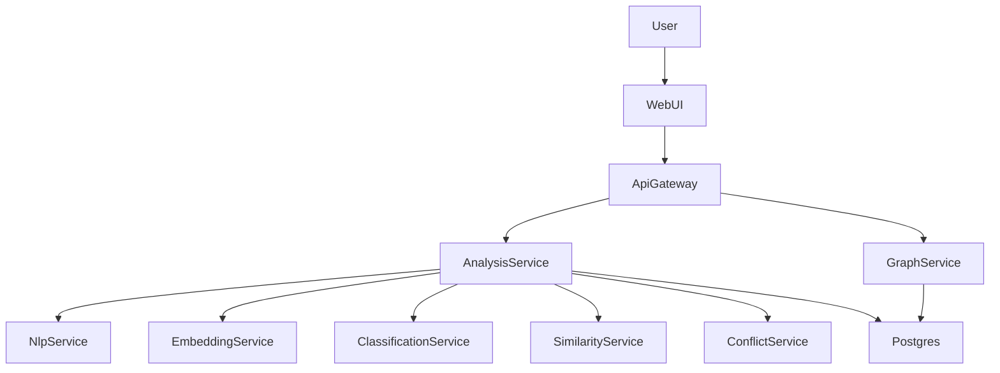

# ML-first AI-система для анализа НПА (Postgres+pgvector)

## Итоговая цель (MVP)
- Принимать тексты НПА (RU/KK), хранить версии.
- Нарезать документ на структурные элементы/нормы.
- Строить эмбеддинги (768), делать similarity top-k.
- Классифицировать нормы/сферы/уровень документа.
- Проверять пары норм на конфликт/дубликат/устаревание.
- Построить граф связей и отдавать его в Web UI.
- Давать объяснения: feature-based + token-perturbation importance.

## Что уже есть в репо
- gRPC каркас сервисов и proto: `[proto/le.proto](proto/le.proto)`, `[crates/le-proto](crates/le-proto)`, 5 сервисов в `[services/](services/)`.
- Общий крейт конфиг/логирование/метрики: `[crates/le-common](crates/le-common)`.

## Архитектура (MVP)

## Хранилище (Postgres + pgvector)
- Поднять `postgres:16` + `pgvector` через `docker-compose`.
- Таблицы (миграции):
  - `documents` (source, version, effective_date, language, raw_text, normalized_text, hash)
  - `norms` (document_id, path/article/point, offsets, text)
  - `embeddings` (norm_id, model_id, vector(768), cached_at)
  - `edges` (from_norm_id, to_norm_id, kind, score, meta_json)
  - `findings` (norm_id, kind, confidence, explanation_json)
  - `jobs` (status, started_at, finished_at, error)

## ML и explainability (реалистичный MVP)
- **Embeddings**: ONNX Runtime (`ort`) или Candle; модель RuBERT/KazBERT/LegalBERT в ONNX.
- **Similarity**: pgvector HNSW/IVF (или plain cosine на первых N) → top-k кандидатов.
- **Classification**: multi-head classifier (или 2–3 отдельных).
- **Conflict**: cross-encoder или pairwise classifier (conflict/duplicate/outdated).
- **Explainability**:
  - Feature layer: temporal overlap / hierarchy / similarity / ссылочные признаки.
  - Token-perturbation: маскирование токенов/фраз и измерение падения confidence → importance.

## Web UI (MVP)
- Страница загрузки документа + запуск анализа.
- Граф: узлы=нормы/документы, рёбра=similarity/conflict/duplicate/outdated/ref.
- Панель фильтров: тип ребра, пороги, версия/дата.
- Карточка нормы: текст + подсветка важных токенов + причины (features).

## Файлы/модули, которые появятся/изменятся
- Расширение protobuf: `[proto/le.proto](proto/le.proto)` (добавить `AnalysisService`, `GraphService`, типы `Document/Norm/Edge/Finding/Job`).
- Новый сервис-оркестратор: `services/analysis-service/`.
- Новый сервис графа/чтения: `services/graph-service/`.
- Новый storage-крейт: `crates/le-storage/` (sqlx или diesel, миграции).
- Docker Compose: `docker-compose.yml` (postgres+pgvector + сервисы).
- Web UI: либо `web/` (frontend) либо отдельный `services/web-ui/` (зависит от выбранного стека).

## Риски/ограничения MVP
- Модели и ONNX-файлы не коммитим в git; грузим через volume/URL и кэшируем локально.
- Время ответа: конфликтный cross-encoder дорогой → делаем каскад: similarity top-k → конфликт.

